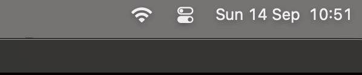
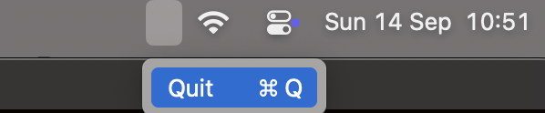

# README

Simple program that checks if CPU usage (across multiple cores) exceeds a
threshold using the `top` command. This program is designed as a showcase for
building a C program and using SwiftUI for the GUI to display the data in the
MacOS menu bar or notifications.

****

The threshold is currently set to 1 to always show cpu usage >= 1% in
`./src/main.c` file. If you adjust it an run the program you will not see the
numbers until the threshold is reached, you will see an invisible box (unless
you hover over it) for the usgmac program, only option is to quit the program.

****

****

**Note**:

- Program takes 3.5 seconds to show up after boot because there is an
    artificial delay timer that is used to refresh the data.

- Because the underlying C code uses command line arguments such as top and
    awk I have decided to remove the line `CODE_SIGN_ENTITLEMENTS = usgmac/usgmac.entitlements;`
    from `macos/usgmac/usgmac.xcodeproj/project.pbxproj` because I have no
    intentions for publishing this on the App store.

## Installation and Usage:

- Run `make install` or `make uninstall`
- Can add this alias to your rc-file: `alias usgmac="open ${HOME}/Applications/usgmac.app"`
